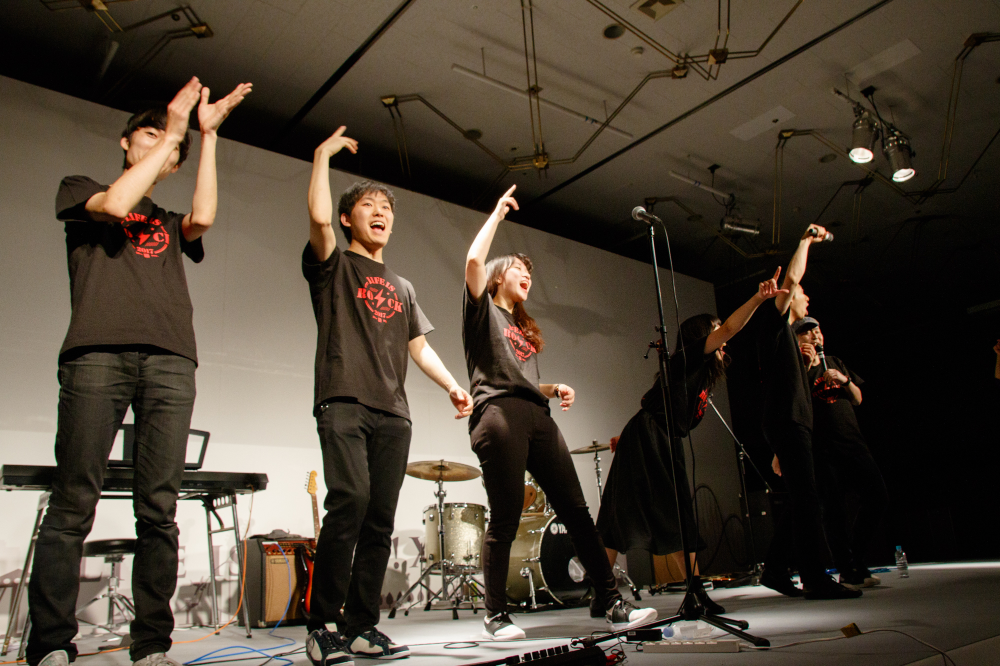

## とうよう


## I am

- 大学三年
- iPhone7期
- iPhone Leaders講師
- 東京大学理学部情報科学科
- Androidアプリをはじめてつくったのは2011年
- git-push-hackathonのアプリをKotlin移植したい
- あとはめんどいので昨日のポートフォリオ会で作りかけてたポートフォリオに載ってる自己紹介載せます


```
転勤族の父のもと、日本の真ん中らへんを転々とし、現在埼玉に腰を落ち着けている東大生。
        <br> 中二でドラマの影響からプログラミングを始め、中高を通した活動の中「ITでのモノづくり」にはまる。
        <br>
        <br> その流れで大学に入学してからLife is Tech !にiPhoneメンターとして携わりながら、アプリ・教材などはじめ多方面のモノづくりに触れる。一方で大学では理学部情報科学科に進学し、Computer Scienceに関して学ぶ。
        <br>
        <br>
        <br> 好きなことは創ること。気の赴くままに数々の創作活動を続けている。
        <br>
        <br> interest: iOS / Android / Web / Guitar / Song / Poem / Compiler / Movie / Graphic / Puzzle
        <br> skill: Swift / Kotlin / Java / C/C++ / Python / HTML / CSS / JavaScript / OCaml / Scheme / Assembly / VerilogHDL
        / Sketch.app / illustrator / Photoshop / Premire / AfterEffects
```
